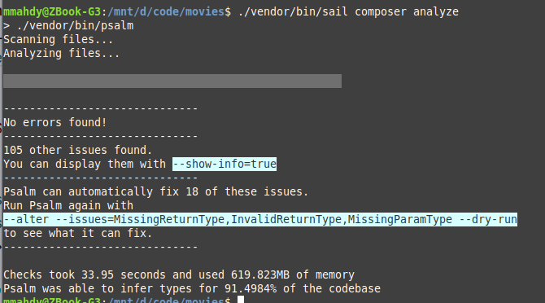
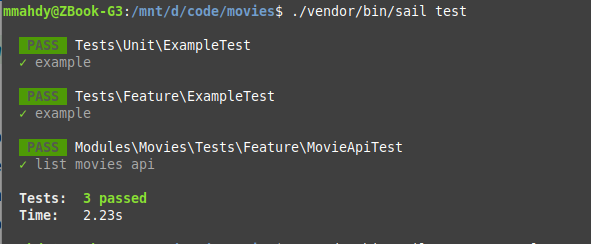
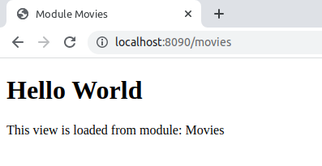

## Laravel Dockerized Modular application

This is an application with modules structure.
I used:
1) Laravel framework v8.
2) [Laravel modules package](https://nwidart.com/laravel-modules/v6/introduction)
3) For docker containers: [Laravel Sail](https://laravel.com/docs/8.x/sail)
4) [Git flow](https://www.atlassian.com/git/tutorials/comparing-workflows/gitflow-workflow)
5) [Action Domain Responder(ADR) pattern](https://martinbean.dev/blog/2016/10/20/implementing-adr-in-laravel/)
6) MySql Database.
7) Mailhog.
8) Redis.
9) [Psalm static code analyzer](https://psalm.dev/).
 

10) Phpunit tests
 

11) Postman.

To run the application follow these steps:
1) make sure you have docker installed on your system and its service process is running
2) in terminal navigate to your project's root folder and run `cp .env.example .env` then `./vendor/bin/sail up` and keep it open and running.
3) Docker will download and build your containers.
4) After success build open another terminal tab or window in project's root folder and run `./vendor/bin/sail composer install`
5) Then `./vendor/bin/sail php artisan migrate`
6) open your browser and open this link [http://localhost:8090/movies](http://localhost:8090/movies).
7) You should see this page   
8) You can import attached postman collection (Movies.postman_collection.json) to test the api.

Of course, you can change ports used for MySQL, Redis, Mailhog and main website in `.env` file or `docker-compose.yml`.
